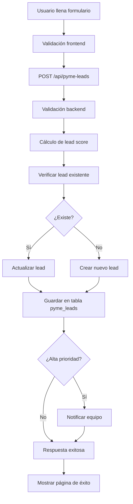

# Formulario de PYMEs - Configuración y Uso

## Resumen

He creado un formulario completo para captar leads de PYMEs con mayor detalle que el formulario principal. Este formulario no está accesible desde la navegación web, sino que será usado enviando el link directo.

## Archivos Creados

### 1. Base de Datos
- **`docs/pyme-leads-table.sql`**: Script SQL para crear la tabla `pyme_leads` en Supabase

### 2. API Route  
- **`src/app/api/pyme-leads/route.ts`**: Endpoint que procesa y guarda los formularios de PYMEs

### 3. Página del Formulario
- **`src/app/pyme-form/page.tsx`**: Formulario completo adaptado para PYMEs

## Configuración

### Paso 1: Crear la tabla en Supabase

1. Ve a tu proyecto de Supabase
2. Abre el SQL Editor
3. Ejecuta el contenido completo del archivo `docs/pyme-leads-table.sql`

### Paso 2: Verificar la configuración

El formulario usa la misma configuración de Supabase que ya tienes, así que no necesita configuración adicional.

## Campos del Formulario

### Campos Requeridos (*)
1. **Nombre y Apellido** - Nombre completo del contacto
2. **Empresa** - Nombre de la empresa (máx. 255 caracteres)
3. **Puesto** - Cargo/posición en la empresa
4. **Email** - Email de contacto
5. **Teléfono (WhatsApp)** - Número de WhatsApp
6. **País** - País de origen (lista predefinida)
7. **Cómo nos conociste** - Canal de adquisición (lista predefinida)
8. **Facturación mensual** - Rango de facturación en pesos

### Campos Opcionales
6. **URL de tu web** - Website de la empresa
10. **Información adicional** - Detalles sobre desafíos y necesidades

## Acceso al Formulario

El formulario estará disponible en:
```
https://tu-dominio.com/pyme-form
```

**Importante**: Esta ruta NO aparece en la navegación del sitio web. Es solo para uso directo mediante link.

## Lead Scoring Inteligente

El sistema calcula automáticamente un score para cada lead basado en:

### Score Base: 50 puntos

### Facturación Mensual:
- Más de $10 millones: +30 puntos
- $5-10 millones: +25 puntos  
- $2-5 millones: +20 puntos
- $500k-2 millones: +15 puntos
- $100k-500k: +10 puntos

### Puesto:
- CEO/Director/Gerente General: +20 puntos
- Gerente/Manager: +15 puntos
- Coordinador/Jefe: +10 puntos

### Otros Factores:
- Tiene website: +10 puntos
- Referencia/Recomendación: +15 puntos
- Google/Búsqueda: +10 puntos
- LinkedIn/Redes: +8 puntos
- Info adicional detallada (>100 chars): +5 puntos

### Prioridades Automáticas:
- **Urgente**: Score ≥90 O (Facturación >$10M + CEO) O Referencia
- **Alta**: Score ≥75
- **Media**: Score ≥60
- **Baja**: Score <60

## Notificaciones

El sistema notifica automáticamente cuando llega un lead de **Alta prioridad** o **Urgente**, mostrando en los logs del servidor:

```
🚨 LEAD PYME DE ALTA PRIORIDAD:
- Nombre: Juan Pérez
- Empresa: Mi Empresa SRL  
- Puesto: CEO
- Email: juan@miempresa.com
- Facturación: Más de $10 millones
- Score: 95
- Prioridad: urgent
```

## Flujo de Datos



## Uso Recomendado

### Para Campañas Específicas:
- Email marketing dirigido
- LinkedIn outreach
- Campañas pagas
- Referencias directas

### Para Segmentación:
- Leads más calificados que el formulario general
- Mayor información para preparar reuniones
- Mejor scoring para priorización

## Monitoreo

Puedes monitorear los leads en:
1. **Supabase Dashboard**: Tabla `pyme_leads`
2. **Logs del servidor**: Información detallada de cada submission
3. **Notificaciones automáticas**: Para leads de alta prioridad

## Próximos Pasos Sugeridos

1. **Integrar con CRM**: Sincronizar automáticamente con tu sistema CRM
2. **Notificaciones avanzadas**: Email/Slack para leads urgentes
3. **Dashboard de leads**: Interfaz para gestionar los leads
4. **Automatización**: Respuestas automáticas por email/WhatsApp
5. **Analytics**: Tracking de conversión por canal

El formulario está listo para usar y comenzar a captar leads de mayor calidad para tu equipo de ventas. 